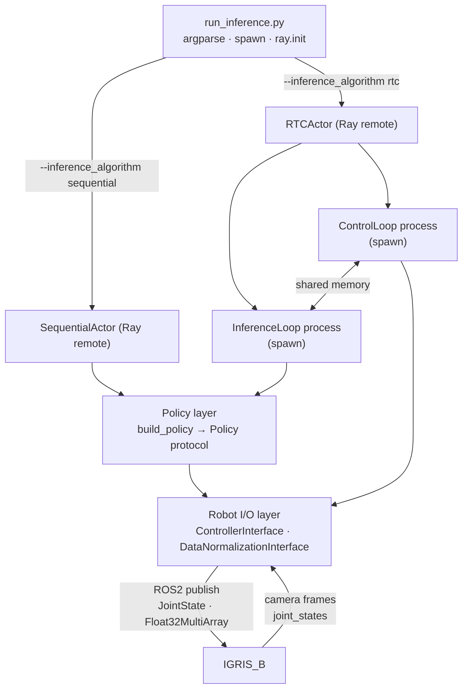

# Architecture

## Table of contents

- [System diagram](#system-diagram)
- [Execution flow](#execution-flow)
- [Data flow per control step](#data-flow-per-control-step)
- [RTC vs Sequential, detailed](#rtc-vs-sequential-detailed)
- [Process and thread topology](#process-and-thread-topology)
- [Lifetime and shutdown](#lifetime-and-shutdown)
- [Performance optimizations](#performance-optimizations)

## System diagram

The four layers and what passes between them. Each layer name links to the folder README.

```
┌──────────────────────────────────────────────────────────────────────────┐
│  CLI ENTRYPOINT                                                          │
│  run_inference.py                                                        │
│  - Parse args (robot, algorithm, config paths)                           │
│  - torch.multiprocessing.set_start_method("spawn")                       │
│  - ray.init(address="auto", namespace="inference_engine")                │
│  - Create Ray actor → call actor.start.remote()                          │
│  - signal.pause() until shutdown                                         │
└──────────────────────────────────┬───────────────────────────────────────┘
                                   │
                ┌──────────────────┴──────────────────┐
                │                                     │
    ┌───────────▼───────────┐           ┌─────────────▼─────────────┐
    │  SequentialActor      │           │  RTCActor                  │
    │  (Ray remote)         │           │  (Ray remote)              │
    │                       │           │                            │
    │  Single-threaded      │           │  Creates 2 processes:      │
    │  control loop         │           │  ┌────────────────────┐    │
    │                       │           │  │ ControlLoop (20Hz) │    │
    │  predict() every      │           │  │ read → publish     │    │
    │  policy_update_period │           │  └────────┬───────────┘    │
    │  steps                │           │           │ shared memory  │
    │                       │           │  ┌────────▼───────────┐    │
    │                       │           │  │ InferenceLoop      │    │
    │                       │           │  │ guided_inference() │    │
    │                       │           │  └────────────────────┘    │
    └───────────┬───────────┘           └─────────────┬─────────────┘
                │                                     │
                └──────────────────┬──────────────────┘
                                   │
    ┌──────────────────────────────▼──────────────────────────────────┐
    │  POLICY LAYER         [env_actor/policy/](../env_actor/policy/) │
    │                                                                 │
    │  build_policy(yaml_path)                                        │
    │  ├─ load_policy_config()           ← YAML with defaults         │
    │  ├─ PolicyConstructorModelFactory  ← Build nn.Module components │
    │  ├─ torch.load(checkpoint)         ← Load weights (optional)    │
    │  └─ POLICY_REGISTRY.get(type)      ← Instantiate policy class   │
    │                                                                 │
    │  Policy Protocol:                                               │
    │  ├─ predict(obs, normalizer)            → (chunk_size, act_dim) │
    │  ├─ guided_inference(obs, ...)          → (chunk_size, act_dim) │
    │  ├─ warmup()                            → CUDA kernel selection │
    │  └─ freeze_all_model_params()           → Disable gradients     │
    └──────────────────────────────┬──────────────────────────────────┘
                                   │
    ┌──────────────────────────────▼──────────────────────────────────┐
    │  ROBOT I/O LAYER      [env_actor/robot_io_interface/](../env_actor/robot_io_interface/) │
    │                                                                 │
    │  ControllerInterface(robot="igris_b")                           │
    │  ├─ read_state()      → {proprio, head, left, right}            │
    │  ├─ publish_action()  → slew-rate limited ROS2 publish          │
    │  ├─ start_state_readers() → background camera + ROS2 threads    │
    │  └─ init_robot_position() → move to home pose                   │
    │                                                                 │
    │  DataNormalizationInterface(robot="igris_b")                    │
    │  ├─ normalize_state()      → z-score proprio, scale images      │
    │  └─ denormalize_action()   → inverse z-score                    │
    └─────────────────────────────────────────────────────────────────┘
```

**Caption.** This is the static layering. It deliberately omits: the Ray driver vs Ray worker distinction (which lives in a separate process from the actor); the two-process structure inside `RTCActor` (drawn instead in [Process and thread topology](#process-and-thread-topology) below); and the shared-memory regions (deep dive in [rtc_shared_memory.md](rtc_shared_memory.md)).

<details>
<summary>Mermaid version</summary>



</details>

## Execution flow

### Startup

1. User runs `python run_inference.py --robot igris_b --inference_algorithm rtc`.
2. `torch.multiprocessing.set_start_method("spawn")` is set. See [concepts.md § Spawn vs fork](concepts.md#spawn-vs-fork).
3. `ray.init(address="auto", namespace="inference_engine")` connects to the existing Ray cluster started by [start_ray.sh](../start_ray.sh).
4. The actor is created with `RTCActor.options(resources={"inference_pc": 1}, num_cpus=3, num_gpus=1).remote(...)` (or the sequential variant). Ray assigns it to the GPU worker.
5. `actor.start.remote()` triggers the actor's initialization. The driver process blocks on `signal.pause()` until `Ctrl+C`.

### Actor initialization (`start()`)

1. `build_policy(policy_yaml_path)` loads the policy:
   - YAML is parsed with defaults composition by the trainer's `load_config`.
   - `PolicyConstructorModelFactory.build(resolved_paths)` produces a dict of `GraphModel` components.
   - If `checkpoint_path` is set, `torch.load(checkpoint_path/<component>.pt, map_location="cpu")` runs for each component.
   - The policy class is resolved via `POLICY_REGISTRY` (auto-imported on miss) and instantiated as `policy_cls(components=components, **policy_params)`.
2. `policy.to(device).eval()` moves the policy to GPU.
3. The actor instantiates `ControllerInterface(runtime_params, topics_config, robot)` and `DataNormalizationInterface(robot, data_stats)`.
4. The actor's data manager is initialized (`DataManagerInterface` in Sequential; `SharedMemoryInterface` in RTC).
5. CUDA hygiene: `torch.backends.cudnn.benchmark = True`, `torch.set_float32_matmul_precision("high")`, `policy.warmup()`.

## Data flow per control step

```
USB Cameras ──────────┐
                      ├──→ read_state() ──→ {proprio, head, left, right}
ROS2 Joint Topics ────┘                              │
                                                     ▼
                                            (Sequential: in-process numpy buffers)
                                            (RTC: shared-memory write)
                                                     │
                                                     ▼
                                            normalize_state()
                                            ├─ proprio: (x - μ) / (σ + ε)
                                            └─ images: x / 255.0
                                                     │
                                                     ▼
                                            policy.predict()    (Sequential)
                                            policy.guided_inference()  (RTC)
                                                     │
                                                     ▼
                                            denormalize_action()
                                            └─ action * σ + μ
                                                     │
                                                     ▼
                                            publish_action()
                                            ├─ slew-rate limit (max_delta)
                                            ├─ ROS2 /target_joints
                                            └─ ROS2 /finger_target
```

In RTC the *control* loop is responsible for the top half (cameras/topics → shared memory → publish) and the *inference* loop handles the middle (read shared memory → policy → write shared memory). The boundary is the shared-memory region.

## RTC vs Sequential, detailed

### Sequential

```
Time ──────────────────────────────────────────────────→

Control: read → predict ─────────→ publish → read → [use cached action] → publish → ...
                 (blocks)           action[0]                                action[1]
```

The control loop blocks while the policy runs. No actions are published during inference. Inference fires every `policy_update_period` steps (default 50 = 2.5 s).

Episode loop: `for t in range(9000):` inside an outer `while True:` — see [sequential_actor.py:108](../env_actor/auto/inference_algorithms/sequential/sequential_actor.py#L108).

### RTC

```
Time ──────────────────────────────────────────────────→

Control:  read → publish → read → publish → read → publish → read → publish → ...
          action[i]        action[i+1]      action[i+2]      new_action[0]

Inference:        ╰── guided_inference() ──────────────────╯
                       (runs in parallel via shared memory)
```

The control loop never blocks. While inference runs, the control loop continues executing actions from the previous chunk. When the new chunk is ready, action inpainting smooths the transition (see [concepts.md § Action inpainting](concepts.md#action-inpainting)).

Episode loop: `for t in range(episode_length):` where `episode_length = 1200` (= 60 s at 20 Hz) — see [control_loop.py:70-118](../env_actor/auto/inference_algorithms/rtc/actors/control_loop.py#L70-L118).

Inference fires when `num_control_iters ≥ min_num_actions_executed` (`= 35`, hardcoded in [inference_loop.py:17](../env_actor/auto/inference_algorithms/rtc/actors/inference_loop.py#L17)).

### Shared-memory layout (RTC)

```
┌─────────────────────────────────────────────────┐
│  Shared Memory Region                           │
│                                                 │
│  proprio  [50 × 24]            float32  ← ctrl  │
│  head     [1 × 3 × 240 × 320]  uint8    ← ctrl  │
│  left     [1 × 3 × 240 × 320]  uint8    ← ctrl  │
│  right    [1 × 3 × 240 × 320]  uint8    ← ctrl  │
│  action   [50 × 24]            float32  ← inf   │
│                                                 │
│  Sync: RLock + 2 Conditions + 2 Events + 2 Values │
└─────────────────────────────────────────────────┘
```

- **Control writes** to: `proprio`, `head`, `left`, `right` (latest observation, FIFO-shifted for proprio).
- **Inference writes** to: `action` (new action chunk).
- **Control reads from**: `action` (current step's command, indexed by `num_control_iters`).
- **Inference reads from**: `proprio`, `head`, `left`, `right`, plus the unexecuted tail of `action` as `prev_action`.

The shapes come from [runtime_params](../env_actor/runtime_settings_configs/robots/igris_b/inference_runtime_params.json): `proprio_history_size=50`, `num_img_obs=1`, `action_chunk_size=50`. Deep dive: [rtc_shared_memory.md](rtc_shared_memory.md).

## Process and thread topology

There are four distinct processes when RTC is running:

| Process | Code | Purpose |
|---|---|---|
| **Main / driver** | [run_inference.py](../run_inference.py) | Parses CLI, calls `ray.init`, creates the actor, blocks on `signal.pause()`. |
| **Ray actor** | [`RTCActor`](../env_actor/auto/inference_algorithms/rtc/rtc_actor.py) | Ray spawned this on the GPU worker. Creates SHM, spawns two children, joins them. Does **not** run the control loop itself. |
| **ControlLoop child** | [`start_control`](../env_actor/auto/inference_algorithms/rtc/actors/control_loop.py) | Connects to Ray, runs the 20 Hz loop, reads cameras + ROS2 topics, publishes actions. Created via `mp.get_context("spawn").Process`. |
| **InferenceLoop child** | [`start_inference`](../env_actor/auto/inference_algorithms/rtc/actors/inference_loop.py) | Connects to Ray, owns the policy on CUDA, runs `guided_inference` in a `torch.inference_mode + autocast(bfloat16)` context. |

Inside each child you also have:

- The `rclpy` `SingleThreadedExecutor` spinning in a background thread (in the control child, to service ROS2 callbacks).
- Two `RBRSCamera` capture threads per camera (one per `singleCamera`), reading frames into a lock-guarded slot.

Sequential is simpler: main + Ray actor only. Cameras and rclpy still get their own threads inside the actor.

## Lifetime and shutdown

The main process is doing one thing: waiting for `Ctrl+C`.

```python
# run_inference.py
import signal
try:
    signal.pause()
except KeyboardInterrupt:
    print("\nShutting down...")
finally:
    ray.shutdown()
    sys.exit()
```

`signal.pause()` blocks until any signal arrives. `Ctrl+C` raises `KeyboardInterrupt` which trips the `except`. `ray.shutdown()` then disconnects from the cluster and tells Ray to terminate the actor.

Inside the RTC actor's `start()` method, the `try/finally` after `inference_runner.start(); controller.start()`:

1. Sets `stop_event`.
2. Calls `control_iter_cond.notify_all()` so any sleeping child wakes up and sees `stop_event` set.
3. `join(timeout=5)` on each child; `terminate()` + `join(timeout=3)` if they didn't exit.
4. `close()` and `unlink()` each shared-memory block, plus `resource_tracker.unregister` to suppress the leak warning that would otherwise fire.

The children themselves have `finally:` blocks that call `shm_manager.cleanup()` (closes their views without unlinking) and `controller_interface.shutdown()` (destroys the rclpy node, shuts down rclpy).

If any of these steps is skipped — e.g. you `kill -9` the actor — shared-memory blocks may linger in `/dev/shm/`. See [troubleshooting.md § Shared memory](troubleshooting.md#shared-memory).

## Performance optimizations

| Optimization | Where | Effect |
|---|---|---|
| `torch.backends.cudnn.benchmark = True` | [inference_loop.py:63](../env_actor/auto/inference_algorithms/rtc/actors/inference_loop.py#L63) | Auto-selects fastest cuDNN kernels per input shape |
| `torch.set_float32_matmul_precision("high")` | [inference_loop.py:64](../env_actor/auto/inference_algorithms/rtc/actors/inference_loop.py#L64) | Uses TensorFloat32 on Ampere+ for matmul |
| `torch.inference_mode()` | [inference_loop.py:119](../env_actor/auto/inference_algorithms/rtc/actors/inference_loop.py#L119) | Disables autograd bookkeeping completely |
| `torch.autocast("cuda", dtype=torch.bfloat16)` | [inference_loop.py:119](../env_actor/auto/inference_algorithms/rtc/actors/inference_loop.py#L119) | Mixed-precision inference |
| `policy.warmup()` (triggers `torch.compile`) | Both actors | JIT-compiles the forward pass on first call |
| Shared memory zero-copy IPC | RTC | No serialization for camera/proprio transfer |
| `policy.eval()` + `freeze_all_model_params()` | Both actors | No gradient memory allocation |
| `multiprocessing.set_start_method("spawn")` | [run_inference.py:87](../run_inference.py#L87) | Safe CUDA + child-process handling |
