# 07 — Factory registration for IGRIS_C

**What this covers.** Every `if robot == "igris_c"` (or equivalent) dispatch site in the codebase. The full graph of which factory hands off to which IGRIS_C-specific module, starting at the CLI entrypoints.
**Who this is for.** Anyone adding IGRIS_D / IGRIS_E in the future, or debugging why "I added a new IGRIS_C feature and it isn't being picked up."

This codebase does not use a centralized registry for robot dispatch. Instead, each layer that needs a robot-specific class has its own `if robot == ...: from .robots.X.foo import Bar` block. There are **eleven such sites for IGRIS_C** on this branch. Get the list right, or your IGRIS_C addition silently won't load.

## Table of contents

- [The dispatch table](#the-dispatch-table)
- [Dispatch graph](#dispatch-graph)
- [Site-by-site](#site-by-site)
- [Checklist: adding a new IGRIS_X](#checklist-adding-a-new-igris_x)

## The dispatch table

Every site where the codebase branches on the `robot` string:

| # | Site | Line | What it dispatches to |
|---|---|---|---|
| 1 | [`run_inference.py:98`](../../run_inference.py#L98) | argparse `choices=["igris_b", "igris_c"]` |
| 2 | [`run_inference_local.py:81`](../../run_inference_local.py#L81) | argparse `choices=["igris_b", "igris_c"]` |
| 3 | [`env_actor/robot_io_interface/controller_interface.py:9-10`](../../env_actor/robot_io_interface/controller_interface.py#L9) | IGRIS_C `ControllerBridge` import |
| 4 | [`env_actor/auto/inference_algorithms/sequential/sequential_actor.py:62-63`](../../env_actor/auto/inference_algorithms/sequential/sequential_actor.py#L62) | IGRIS_C `RuntimeParams` import |
| 5 | [`env_actor/auto/inference_algorithms/sequential/data_manager/data_manager_interface.py:6-7`](../../env_actor/auto/inference_algorithms/sequential/data_manager/data_manager_interface.py#L6) | IGRIS_C sequential `DataManagerBridge` import |
| 6 | [`env_actor/auto/inference_algorithms/sequential_local/sequential_local_actor.py:62-63`](../../env_actor/auto/inference_algorithms/sequential_local/sequential_local_actor.py#L62) | IGRIS_C `RuntimeParams` import (mirror of #4) |
| 7 | [`env_actor/auto/inference_algorithms/rtc/rtc_actor.py:38-39`](../../env_actor/auto/inference_algorithms/rtc/rtc_actor.py#L38) | IGRIS_C `RuntimeParams` import (parent process) |
| 8 | [`env_actor/auto/inference_algorithms/rtc/actors/control_loop.py:34-35`](../../env_actor/auto/inference_algorithms/rtc/actors/control_loop.py#L34) | IGRIS_C `RuntimeParams` import (control-side child) |
| 9 | [`env_actor/auto/inference_algorithms/rtc/actors/inference_loop.py:35-36`](../../env_actor/auto/inference_algorithms/rtc/actors/inference_loop.py#L35) | IGRIS_C `RuntimeParams` import (inference-side child) |
| 10 | [`env_actor/auto/inference_algorithms/rtc/data_manager/shm_manager_interface.py:30-31`](../../env_actor/auto/inference_algorithms/rtc/data_manager/shm_manager_interface.py#L30) | IGRIS_C RTC `SharedMemoryManager` import |
| 11 | [`env_actor/auto/inference_algorithms/rtc_local/rtc_local_actor.py:37-38`](../../env_actor/auto/inference_algorithms/rtc_local/rtc_local_actor.py#L37) | IGRIS_C `RuntimeParams` import (RTC-local parent) |
| 12 | [`env_actor/auto/inference_algorithms/rtc_local/actors/control_loop.py:30-31`](../../env_actor/auto/inference_algorithms/rtc_local/actors/control_loop.py#L30) | IGRIS_C `RuntimeParams` import (RTC-local control child) |
| 13 | [`env_actor/auto/inference_algorithms/rtc_local/actors/inference_loop.py:31-32`](../../env_actor/auto/inference_algorithms/rtc_local/actors/inference_loop.py#L31) | IGRIS_C `RuntimeParams` import (RTC-local inference child) |
| 14 | [`env_actor/auto/inference_algorithms/rtc_local/data_manager/shm_manager_interface.py:30-31`](../../env_actor/auto/inference_algorithms/rtc_local/data_manager/shm_manager_interface.py#L30) | IGRIS_C RTC-local `SharedMemoryManager` import |
| 15 | [`env_actor/nom_stats_manager/data_normalization_interface.py:9-10`](../../env_actor/nom_stats_manager/data_normalization_interface.py#L9) | IGRIS_C `DataNormalizationBridge` import |

That is **15 sites total**. The first two are argparse `choices` (you must list a new robot there or `argparse` will reject `--robot igris_d`). The remaining 13 are runtime imports.

(`TODO:` the seven repeated `RuntimeParams` imports — sites 4, 6, 7, 8, 9, 11, 12, 13 — are essentially duplicate dispatch. A central `runtime_params_for(robot)` helper would collapse them into one site. Until then, every new robot needs to be added to all seven.)

## Dispatch graph

```mermaid
flowchart TD
  CLI1["run_inference.py<br/>argparse --robot igris_c"]:::cli
  CLI2["run_inference_local.py<br/>argparse --robot igris_c"]:::cli

  CLI1 -->|--inference_algorithm rtc| RTCActor["RTCActor (Ray)<br/>rtc_actor.py"]
  CLI1 -->|--inference_algorithm sequential| SeqActor["SequentialActor (Ray)<br/>sequential_actor.py"]
  CLI2 -->|--inference_algorithm rtc| RTCLocal["RTCLocalActor<br/>rtc_local_actor.py"]
  CLI2 -->|--inference_algorithm sequential| SeqLocal["SequentialLocalActor<br/>sequential_local_actor.py<br/><i>(currently smoke-test only)</i>"]

  RTCActor -->|"if robot == 'igris_c': import RuntimeParams"| RP[runtime_settings_configs/robots/igris_c/<br/>inference_runtime_params.RuntimeParams]
  RTCActor -->|spawn child| Ctrl[start_control<br/>rtc/actors/control_loop.py]
  RTCActor -->|spawn child| Inf[start_inference<br/>rtc/actors/inference_loop.py]

  Ctrl -->|"if robot == 'igris_c'"| RP
  Inf  -->|"if robot == 'igris_c'"| RP

  Ctrl --> ControllerIF["ControllerInterface<br/>controller_interface.py"]
  ControllerIF -->|"if robot == 'igris_c': import ControllerBridge"| Bridge[robot_io_interface/robots/igris_c/<br/>controller_bridge.ControllerBridge]
  Bridge -->|imports| Msgs[messages/igris_c_msgs.py]
  Bridge -->|imports| InitP[init_params.py]
  Bridge -->|reads from| RP

  Ctrl --> RTC_SHM["SharedMemoryInterface<br/>rtc/data_manager/shm_manager_interface.py"]
  Inf  --> RTC_SHM
  RTC_SHM -->|"if robot == 'igris_c': import SharedMemoryManager"| SHMBridge[rtc/data_manager/robots/igris_c/<br/>shm_manager_bridge.SharedMemoryManager]
  SHMBridge -->|imports INIT_ACTION_17| InitP

  Inf --> NormIF["DataNormalizationInterface<br/>nom_stats_manager/data_normalization_interface.py"]
  NormIF -->|"if robot == 'igris_c': import DataNormalizationBridge"| NormBridge[nom_stats_manager/robots/igris_c/<br/>data_normalization_manager.DataNormalizationBridge]
  NormBridge -->|reads pkl| Stats["norm_stats_file_path<br/>(from JSON)"]

  SeqActor -->|"if robot == 'igris_c'"| RP
  SeqActor --> ControllerIF
  SeqActor --> SeqDataIF["DataManagerInterface<br/>sequential/data_manager/data_manager_interface.py"]
  SeqDataIF -->|"if robot == 'igris_c': import DataManagerBridge"| SeqData[sequential/data_manager/robots/igris_c/<br/>data_manager_bridge.DataManagerBridge]
  SeqData -->|reads INIT_ACTION_17| InitP
  SeqActor --> NormIF

  RTCLocal -->|"if robot == 'igris_c'"| RP
  RTCLocal -->|spawn child| CtrlL["start_control<br/>rtc_local/actors/control_loop.py"]
  RTCLocal -->|spawn child| InfL["start_inference<br/>rtc_local/actors/inference_loop.py"]
  CtrlL -->|"if robot == 'igris_c'"| RP
  InfL  -->|"if robot == 'igris_c'"| RP
  CtrlL --> ControllerIF
  CtrlL --> RTC_SHM_L["SharedMemoryInterface<br/>rtc_local/data_manager/shm_manager_interface.py"]
  InfL  --> RTC_SHM_L
  RTC_SHM_L -->|"if robot == 'igris_c': import SharedMemoryManager"| SHMBridgeL[rtc_local/data_manager/robots/igris_c/<br/>shm_manager_bridge.SharedMemoryManager]
  InfL --> NormIF

  SeqLocal -->|"if robot == 'igris_c'"| RP
  SeqLocal --> ControllerIF
  SeqLocal --> SeqDataIF

  classDef cli fill:#ffe,stroke:#888,stroke-width:1px;
```



ASCII fallback (same content, less pretty):

```
run_inference.py / run_inference_local.py
    │ (argparse: --robot igris_c, --inference_algorithm {rtc,sequential})
    ▼
┌─────────────────────────────────────────────────────────────────────────────┐
│ Actor parent (RTCActor | SequentialActor | RTCLocalActor | SeqLocalActor)   │
│   if robot == "igris_c":                                                    │
│       from runtime_settings_configs/robots/igris_c/                         │
│            inference_runtime_params import RuntimeParams                     │
└─────────────────────────────────────────────────────────────────────────────┘
                      │ (RTC only: spawn two children)
                      ▼
┌─────────────────────────────────────────────────────────────────────────────┐
│  Child: start_control                                                       │
│    if robot == "igris_c": import RuntimeParams (again, in this process)     │
│    ControllerInterface(robot="igris_c")                                     │
│       if robot == "igris_c": import ControllerBridge ─→                     │
│         robot_io_interface/robots/igris_c/controller_bridge.py              │
│            ▲                                                                │
│            │ imports: init_params.py, messages/igris_c_msgs.py              │
│    SharedMemoryInterface(robot="igris_c", ...)                              │
│       if robot == "igris_c": import SharedMemoryManager ─→                  │
│         rtc/data_manager/robots/igris_c/shm_manager_bridge.py               │
└─────────────────────────────────────────────────────────────────────────────┘

┌─────────────────────────────────────────────────────────────────────────────┐
│  Child: start_inference                                                     │
│    if robot == "igris_c": import RuntimeParams                              │
│    SharedMemoryInterface(robot="igris_c", ...) (attaches by name)           │
│    DataNormalizationInterface(robot="igris_c", data_stats=...)              │
│       if robot == "igris_c": import DataNormalizationBridge ─→              │
│         nom_stats_manager/robots/igris_c/data_normalization_manager.py      │
└─────────────────────────────────────────────────────────────────────────────┘
```

For the sequential algorithm, the actor process **is** the inference + control loop in one; the same imports happen but in one process. For `sequential_local`, ditto, but the actor's `start()` is currently a smoke test (writes three PNGs and returns — see [02 § sequential_local](02_changes_vs_main.md#env_actorautoinference_algorithmssequential_local__init__py-and-sequential_local_actorpy-added--2-files)).

## Site-by-site

For each numbered site in [the table above](#the-dispatch-table), what it does and what would happen if `igris_c` were missing.

### 1. `run_inference.py:98` (argparse)

```python
parser.add_argument("--robot", default="igris_b", choices=["igris_b", "igris_c"])
```

Without `"igris_c"` here, `argparse` would reject `--robot igris_c` at parse time with `error: argument --robot: invalid choice: 'igris_c'`. Note `default="igris_b"`.

### 2. `run_inference_local.py:81` (argparse)

```python
parser.add_argument("--robot", default="igris_b", choices=["igris_b", "igris_c"])
```

Same pattern; same default. Note that the **default values for the two `--inference_runtime_*` flags** in `run_inference_local.py` point at IGRIS_C paths (lines 84 and 89), whereas in `run_inference.py` they point at IGRIS_B paths. Confusing — see [02 § run_inference_local.py](02_changes_vs_main.md#run_inference_localpy-added).

### 3. `controller_interface.py:9-10` (active dispatch)

```python
elif robot == "igris_c":
    from .robots.igris_c.controller_bridge import ControllerBridge
self.controller_bridge = ControllerBridge(
    runtime_params=runtime_params,
    inference_runtime_topics_config=inference_runtime_topics_config,
)
```

The single most important dispatch site. Without this, the inference engine literally cannot talk to the IGRIS_C hardware. The `ControllerBridge` instantiated here is what every algorithm calls into via the `ControllerInterface` wrapper.

### 4. `sequential_actor.py:62-63`

```python
elif self.robot == "igris_c":
    from env_actor.runtime_settings_configs.robots.igris_c.inference_runtime_params import RuntimeParams
```

The actor instantiates `RuntimeParams(inference_runtime_params_config)` directly on line 66. Without this dispatch, the actor builds an IGRIS_B `RuntimeParams` (no DDS properties) and downstream the controller bridge fails on `runtime_params.dds_topics`.

### 5. `sequential/data_manager/data_manager_interface.py:6-7`

```python
elif robot == "igris_c":
    from env_actor.auto.inference_algorithms.sequential.data_manager.robots.igris_c.data_manager_bridge import DataManagerBridge
```

Without this, sequential IGRIS_C runs would build the IGRIS_B `DataManagerBridge` (which would still work since the bridge interface is identical) — but `serve_init_action()` would emit a 24-D vector and the controller's 17-D assertion at `controller_bridge.py:389` would crash.

### 6. `sequential_local_actor.py:62-63`

Mirror of site #4 in the local actor. As of this branch the local sequential actor's `start()` is mostly commented out, so site #6 is exercised but most of what comes after is dormant.

### 7. `rtc_actor.py:38-39`

```python
elif self.robot == "igris_c":
    from env_actor.runtime_settings_configs.robots.igris_c.inference_runtime_params import RuntimeParams
```

The parent process uses `RuntimeParams` to size the shared-memory blocks ([`rtc_actor.py:54-69`](../../env_actor/auto/inference_algorithms/rtc/rtc_actor.py#L54)). Wrong `RuntimeParams` here ⇒ wrong SHM block sizes ⇒ shape mismatches in children.

### 8 and 9. RTC `control_loop.py` and `inference_loop.py`

Each child process re-runs the same dispatch independently. This is because `spawn` start method does **not** carry parent state — the child re-imports everything from scratch. Both children read the same JSON, build their own `RuntimeParams`, and use it for their own concerns (control side: bridge gains, DT, max_delta. Inference side: stats path, action_chunk_size).

### 10. `rtc/data_manager/shm_manager_interface.py:30-31`

```python
elif robot == "igris_c":
    from env_actor.auto.inference_algorithms.rtc.data_manager.robots.igris_c.shm_manager_bridge import SharedMemoryManager
```

Without this, RTC IGRIS_C runs would build the IGRIS_B `SharedMemoryManager` whose `init_action_chunk()` tiles a 24-D `INIT_JOINT` instead of `INIT_ACTION_17`. The SHM action block is sized 17-D (because the parent used the IGRIS_C `RuntimeParams`); the IGRIS_B-style init tries to broadcast 24-element rows into 17-element rows and `np.copyto` raises a shape error.

### 11–14. RTC-local mirrors

Sites 11–14 mirror sites 7–10 for the `rtc_local/` subtree. Same semantics, parallel files.

### 15. `nom_stats_manager/data_normalization_interface.py:9-10`

```python
elif robot == 'igris_c':
    from .robots.igris_c.data_normalization_manager import DataNormalizationBridge
```

Without this, IGRIS_C inference would silently use the IGRIS_B normalizer. The IGRIS_B normalizer expects exactly 24-element mean/std vectors and does no proprio-length slicing, so loading IGRIS_C's 86-D proprio against IGRIS_B-style stats would either silently underflow (slicing) or shape-error (broadcasting), depending on which key is hit first.

## Checklist: adding a new IGRIS_X

If you ever add IGRIS_D (or similar), use this checklist. Each item resolves to a single one-line `elif robot == "igris_d": ...` addition in the corresponding file.

- [ ] **Argparse** in [`run_inference.py:98`](../../run_inference.py#L98).
- [ ] **Argparse** in [`run_inference_local.py:81`](../../run_inference_local.py#L81).
- [ ] **Runtime configs**: create `env_actor/runtime_settings_configs/robots/igris_d/` with `init_params.py`, `inference_runtime_params.{json,py}`, `inference_runtime_topics.json`, plus any DDS XML if needed. See [04](04_runtime_configuration_igris_c.md).
- [ ] **`ControllerBridge`**: create `env_actor/robot_io_interface/robots/igris_d/controller_bridge.py`. Add the dispatch in [`controller_interface.py:9`](../../env_actor/robot_io_interface/controller_interface.py#L9).
- [ ] **`RuntimeParams`** dispatch in **seven** places: `sequential_actor.py`, `sequential_local_actor.py`, `rtc_actor.py`, `rtc/actors/control_loop.py`, `rtc/actors/inference_loop.py`, `rtc_local_actor.py`, `rtc_local/actors/control_loop.py`, `rtc_local/actors/inference_loop.py`.
- [ ] **Sequential `DataManagerBridge`**: create `sequential/data_manager/robots/igris_d/data_manager_bridge.py`. Add the dispatch in [`sequential/data_manager/data_manager_interface.py:6`](../../env_actor/auto/inference_algorithms/sequential/data_manager/data_manager_interface.py#L6).
- [ ] **RTC `SharedMemoryManager`**: create `rtc/data_manager/robots/igris_d/shm_manager_bridge.py` **and** `rtc_local/data_manager/robots/igris_d/shm_manager_bridge.py` (same file). Add the dispatch in both `shm_manager_interface.py` files.
- [ ] **`DataNormalizationBridge`**: create `nom_stats_manager/robots/igris_d/data_normalization_manager.py`. Add the dispatch in [`nom_stats_manager/data_normalization_interface.py:9`](../../env_actor/nom_stats_manager/data_normalization_interface.py#L9).
- [ ] **Policy YAML**: if `action_dim` changes, either fork [`openpi_batched.yaml`](../../env_actor/policy/policies/openpi_policy/components/openpi_batched.yaml) per-robot or guard the value with `--policy_yaml_path`. See [02 § openpi_batched.yaml](02_changes_vs_main.md#env_actorpolicypoliciesopenpi_policycomponentsopenpi_batchedyaml-modified).

The existing walkthrough [`docs/walkthroughs/04_add_a_new_robot.md`](../walkthroughs/04_add_a_new_robot.md) gives the longer-form version of this checklist with example code. IGRIS_C/c1 is the first concrete instance of that walkthrough being executed.

---

← Back to index: [README.md](README.md) · Next → [08_running_and_extending_igris_c.md](08_running_and_extending_igris_c.md)
